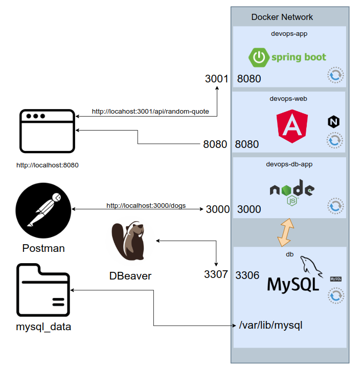

# Taller introducción a Docker y Docker-Compose

## Objetivo

El objetivo del taller será ofrecer a las personas asitentes una visión práctica de la importancia y manejo de Docker y Docker-Compose en las soluciones de aplicaciones empresariales.

## Caso práctico - Orquestación con Docker-Compose

Se plantea el siguiente caso práctico.

En la carpeta caso-practico-docker-compose se encuentran los proyectos involucrados en el esquema; los cuales hay que Dockerizar individualmente y orquestar su funcionamiento.