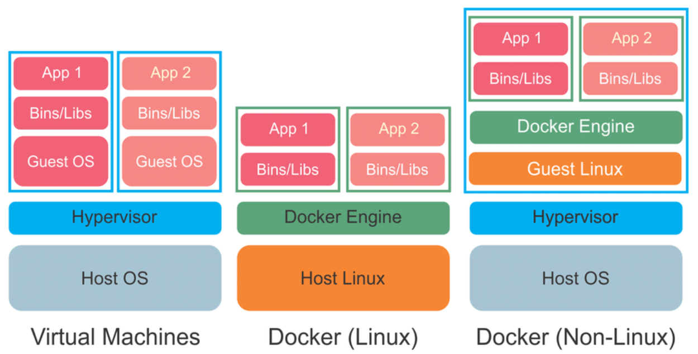

# Introducción

## ¿Qué es Docker?

Si hablamos de una herramienta que ha cambiado el panorama del desarrollo esa es sin duda Docker, que ha marcado un antes y un después en la calidad de vida de los miembros del ciclo de desarrollo, simplificando en buena medida y favoreciendo la automatización de procesos como la instalación de base de datos, el despliegue de aplicaciones, las pruebas de todo el sistema desde la propia máquina de desarrollo, etc...

Además permite a otras personas levantar servicios que no han desarrollado pero necesitan para su desarrollo: por ejemplo, las personas de front pueden levantar el back sin tener el código fuente ni los runtimes instalados en su máquina.

Podemos llegar a levantar en nuestras máquinas de desarrollo el entorno completo de nuestra solución, lo que facilita el poder realizar todas las pruebas posibles antes de subir a la rama de integración, permitiendo tener un entorno previo a producción menos que mantener.

> Su principal uso reside en el empaquetado de aplicaciones dentro de contenedores para su posterior ejecución en todo tipo de entornos donde aseguramos la compatibilidad y que siempre se trabaja con las mismas versiones de tecnología.

## Sistemas de virtualización

Un avance muy importante ocurrido en los últimos años es la virtualización de sistemas que ha permitido abaratar el coste de los servidores exprimiendo al máximo sus recursos. En la actualidad podemos contar varios tipos de virtualización.

### Virtualización pesada

Se trata de la virtualización que podemos hacer con Virtualbox y/o VMware entre otros; y que consiste en crear máquinas virtuales completas sobre la máquina anfitriona a través de una capa de hypervisor donde podemos instalar cualquier otro sistema operativo compatible. Es la forma de tener Linux en Windows o viceversa.

La ventaja es que tienes todo un sistema operativo como si estuviera instalado en una máquina física al lado de la tuya.

La desventaja es que los recursos quedan asignados de forma fija; es decir, el espacio de disco y de memoria que se le da, no puede ser aprovechado por ninguna otra máquina. Esta desventaja hace que solo podamos tener un número de máquina virtuales muy limitado en una misma máquina física.

### Virtualización ligera en Linux

La virtualización ligera de contenedores solo se puede dar en máquinas Linux ya que hace uso de los cgroups que es una propiedad del núcleo de Linux para la ejecución de procesos de manera aislada.

Esta propiedad nos permite levantar procesos ligeros que simulan distintos sistemas operativos, aunque con la limitación de que tienen que ser compatibles con el Kernel de la máquina física y estos pueden ser: alpine, centos, ubuntu, etc… 

Todos los procesos comparten el mismo espacio de memoria y de disco, aunque se le pueden asignar cuotas. Esto hace que podamos levantar muchos más contenedores en una misma máquina física.

Este es el principio de contenedor que usa Docker para levantar los servicios y las aplicaciones en estos sistemas operativos, pero hay que tener en cuenta que si no establecemos volúmenes de datos, los contenedores son volátiles, es decir, la información la mantienen hasta que se eliminan.

Si hacemos uso de sistemas Ubuntu tenemos a nuestra disposición otro tipo de virtualización ligera no volátil, llamada LXC. Con LXC podemos crear contenedores que realmente se comportan como máquinas virtuales ligeras.

### Virtualización ligera en Windows/MacOs

Esto es lo que conocemos como Docker "nativo" donde nos instalamos una aplicación que por debajo nos instala una máquina virtual con Linux para poder correr Docker. Estas aplicaciones nos proveen de una interfaz que nos abstrae del todo de este hecho, y nos permite ejecutar comandos de Docker como si estuviéramos en Linux. Algunas de estas herramientas requieren el uso de VirtualBox.

