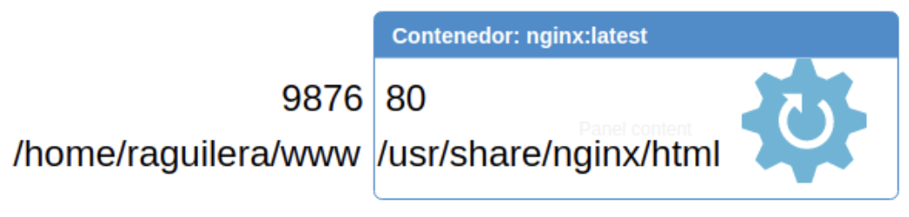

# Docker

## Conceptos básicos

- **Imagen**: es la "receta" que escribimos para definir cómo queremos la "mini-máquina". Qué cosas queremos que tenga instalada.
Servidor nginx para desplegar aplicación React.

- **Contenedor**: es la "mini-máquina" corriendo en nuestra máquina el servicio que hayamos especificado. Aplicación React desplegada.

- **Registros**: son repositorios remotos donde almacenamos y descargamos imágenes de Docker. Pueden ser privados a nivel de empresa o públicos en Docker Hub.

- **Docker Client**: es el cliente de Docker que tenemos que instalar en nuestra máquina para poder trabajar con Docker.

## Instalación

Sea cual sea tu sistema operativo la forma más sencilla y legal de tenerlo es instalando [Rancher Desktop](https://rancherdesktop.io/). Una vez instalado se arranca y se selecciona como "engine" dockerd (moby), activar Kubernetes no es necesario para este taller.

### Comandos básicos

#### Hacer un hello world

```bash
docker run hello-world
```

#### Arrancar un contenedor y entrar dentro

```bash
docker run -it alpine /bin/sh
```

#### Ejecutar un comando dentro del contenedor

```bash
docker run -it alpine comando
```

#### Levantar un nuevo servidor web

```bash
docker run -d -p "9876:80" -v "$PWD/www:/usr/share/nginx/html" nginx
```



> Nota: Los contenedores siempre tienen que tener dentro un proceso activo corriendo, en caso contrario se paran y dejan de dar servicio.

#### Ver los contenedores que están corriendo

```bash
docker ps [-a]
```

#### Entrar dentro del contenedor activo con el servidor web

```bash
docker exec -it id_contenedor /bin/bash
```

Nota: acceder a /usr/share/nginx/html y añadir contenido

#### Parar un contenedor activo

```bash
docker stop id_contenedor
```

#### Arrancar un contenedor parado

```bash
docker start id_contenedor
```

#### Matar un contenedor activo

```bash
docker kill id_contenedor
```

#### Eliminar un contenedor no activo

```bash
docker rm id_contenedor
```

#### Ver las imágenes almacenadas localmente

```bash
docker images
```

#### Eliminar una imagen sin contenedores asociados

```bash
docker rmi id_imagen
```

#### Traer una imagen de un repositorio de Docker

```bash
docker pull mysql:5.7
```

### Comandos útiles

#### Parar todos los contenedores

```bash
docker stop $(docker ps -a -q)
```

#### Borrar los contenedores con un cierto estado

```bash
docker rm -f $(docker ps -a | grep Dead | cut -d ' ' -f 1)
```

#### Borrar todos los contenedores

```bash
docker rm $(docker ps -a -q)
```

#### Borrar todas las imágenes

```bash
docker rmi $(docker images -q)
```

### Dockerfile para la creación de imágenes

Las imágenes de las que parten los contenedores de Docker se crean a partir de un fichero generalmente llamado **Dockerfile**. 

Es importante que tengamos en mente que estás imágenes serán utilizadas en producción por lo que es importante que sean lo más pequeñas y lo más seguras posibles, intentando que siempre arranque con un usuario **non root**.

Es un fichero de texto que puede contener las siguientes sentencias.

* **FROM:** define la imagen de la que se parte
* **LABEL:** permite establecer una serie de etiquetas clave=valor que se mostrarán en el docker inspect. Ejemplo, LABEL maintainer=”devel@acme.com”
* **ENV:** permite definir variables de entorno que pueden ser utilizadas en el mismo Dockerfile y sobreescritas desde docker run con --env clave=’valor’. Se utiliza para definir versiones o paths que puedan cambiar de una construcción a otra.
* **COPY src dest** copia un archivo o directorio de la máquina dentro del contenedor utilizando los paths especificados en src y dest.
* **ADD src dest** igual que COPY pero si el archivo está comprimido, al copiarlo lo descomprime.
* **RUN:** ejecuta comandos shell dentro del contenedor, hay que tener en cuenta el sistema operativo definido por el ***FROM***. No se puede hacer apt en CentOS, por ejemplo.
* **WORKDIR:** posiciona la ejecución en un path determinado dentro del contenedor, mejor que hacer “RUN cd /opt”. Es buena práctica utilizar paths absolutos.
* **USER:** se puede definir un usuario no root que exista dentro del contenedor, ya que por defecto, todos los comandos se ejecutarán con el usuario root.
* **EXPOSE:** define un puerto donde el contenedor quedará escuchando peticiones. La buena práctica es mantener los puertos por defecto, por ejemplo, en nginx mantenemos el puerto 80 para que el usuario de la imagen pueda mapear de forma externa al puerto que considere.
* **VOLUME:** define un path que el contenedor define para permitir montar volúmenes externos a fin de compartir información desde fuera hacia dentro. 
* **CMD ["comando","arg","arg",...]:** Permite ejecutar comandos dentro del contenedor. Se puede sobreescribir desde un docker run.
* **ENTRYPOINT:** se utiliza para establecer el comando principal de ejecución de la imagen. Permite su sobreescritura desde docker run. Suele utilizarse para ejecutar bash scripts que tienen que añadirse en la imagen.

#### Ejemplo para proyecto Java con Maven

```dockerfile
FROM maven:3.8-openjdk-11 as builder
WORKDIR /workspace
COPY src src
COPY pom.xml .
RUN mvn clean package -Dmaven.test.skip=true

FROM openjdk:11-jre-slim-buster
WORKDIR /app
COPY --from=builder /workspace/target/*.jar app.jar
EXPOSE 8080
CMD ["java", "-jar", "app.jar"]

RUN groupadd -r appuser && useradd --no-log-init -r -g appuser appuser
USER appuser
```

#### Ejemplo para NodeJS

```dockerfile
FROM node:14.19.1-alpine3.14
WORKDIR /usr/src/app
COPY . .
RUN npm ci
RUN npm run build
RUN npm prune --production
EXPOSE 3000
CMD [ "npm", "run", "start:prod" ]
USER node
```

#### Ejemplo para SPA 

```dockerfile
FROM node:14.19.1-alpine3.14 as builder
RUN mkdir /ng-app
WORKDIR /ng-app
COPY package.json package-lock.json ./
RUN npm ci
COPY . .
RUN npm run build -- ---output-path=dist

FROM nginxinc/nginx-unprivileged:1.23
USER root
RUN rm -rf /usr/share/nginx/html/*
COPY nginx/default.conf /etc/nginx/conf.d/
COPY --from=builder /ng-app/dist /usr/share/nginx/html
USER nginx
EXPOSE 8080
CMD ["nginx", "-g", "daemon off;"]
```
Para evitar el problema de 404 cuando necesitamos enrutar las páginas de una SPA tenemos que añadir el siguiente fichero nginx/default.conf el cual se copia en el dockerfile.

```nginx
server {

  listen 8080;

  sendfile on;

  default_type application/octet-stream;

  gzip on;
  gzip_http_version 1.1;
  gzip_disable      "MSIE [1-6]\.";
  gzip_min_length   256;
  gzip_vary         on;
  gzip_proxied      expired no-cache no-store private auth;
  gzip_types        text/plain text/css application/json application/javascript application/x-javascript text/xml application/xml application/xml+rss text/javascript;
  gzip_comp_level   9;


  root /usr/share/nginx/html;


  location / {
    try_files $uri $uri/ /index.html =404;
  }

}
```

### Construir la imagen y subirla al repositorio

Como ejemplo sencillo, vamos a crear dentro de nuestro directorio un fichero index.js con el siguiente contenido:

```javascript
var os = require("os");
var hostname = os.hostname();
console.log("Hola desde " + hostname);
``` 

Para poder ejecutar este fichero de JavaScript del lado del servidor necesitamos un runtime de nodejs, por ello, vamos a partir de un sistema operativo **alpine**, donde vamos a instalar todo lo necesario, copiamos el fichero **index.js** y lo ejecutamos con nodejs:

```dockerfile
FROM alpine
RUN apk update && apk add nodejs
COPY . /app
WORKDIR /app
CMD ["node","index.js"]
```

Una vez tenemos definida nuestra receta es el momento de contruir la imagen, para lo cual en el mismo directorio donde esté el fichero Dockerfile y el fichero index.js, vamos a ejecutar:

```bash
docker build -t docker-workshop:1.0 .
```

Esto nos va a permitir poder ejecutar la imagen y crear distintos contenedores para probar su funcionamiento en local:

```bash
docker run docker-workshop:1.0
```

En caso de haberlo hecho previamente tenemos que taggear la imagen anteponiendo nuestro nombre de usuario de Docker Hub.

```bash
docker tag docker-workshop:1.0 tu-usuario/docker-workshop:1.0
```

Una vez probada es momento de subirlo a nuestro repositorio en docker hub. Para ello primero tenemos que logarnos:

```bash
docker login -U USER -p PASS
```

Una vez logados podemos subir nuestras imágenes para compartir con el comando:

```bash
docker push tu-usuario/docker-workshop:1.0
```