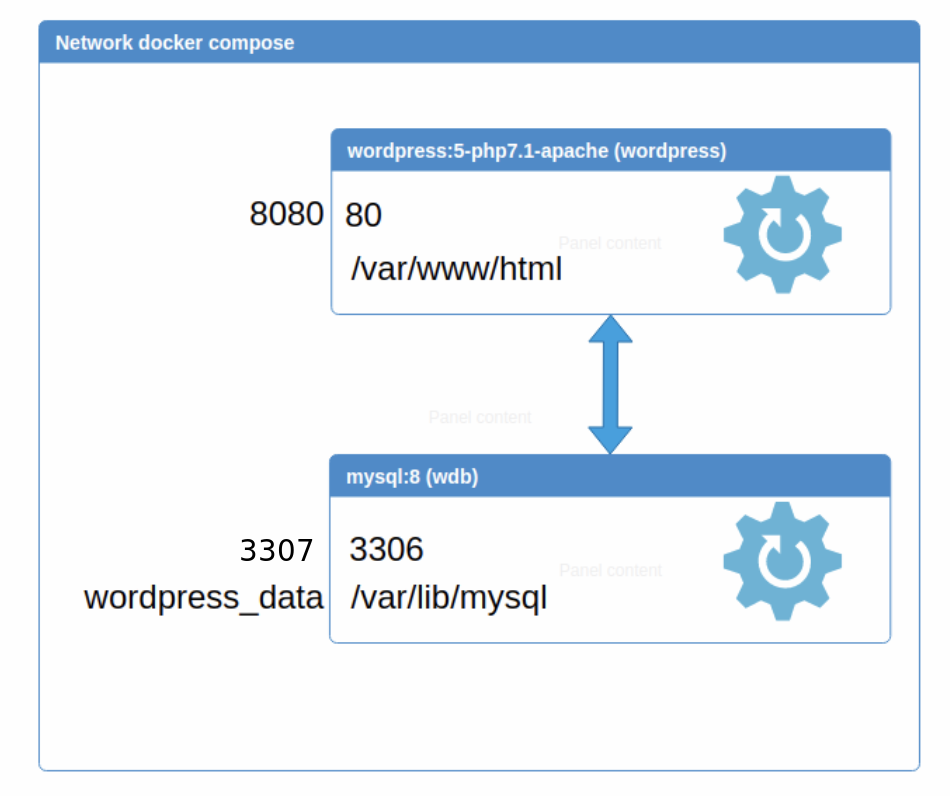

# Docker Compose

Levantar sistemas completos solo con Docker se hace costoso. Para eso tenemos **docker-compose.yml** que a través de un fichero de texto permite levantar n servicios/contenedores de Docker a través de comandos.

## Instalación y configuración en Ubuntu

```bash
$> sudo curl -L https://github.com/docker/compose/releases/download/v2.11.1/docker-compose-`uname -s`-`uname -m` -o /usr/local/bin/docker-compose
$> sudo chmod +x /usr/local/bin/docker-compose
$> docker-compose -version
```

## Instalación y configuración en MacOs y Windows

Ya viene al instalar Rancher Desktop.

## Funcionamiento

A través de la definición dentro del fichero docker-compose.yml podemos levantar y orquestar *n* contenedores Docker. 

Por ejemplo, podemos montar un wordpress con su base de datos asociada:

```yml
version: "3.3"
services:
  wdb:
    image: mysql:5.7
    volumes:
      - wordpress_data:/var/lib/mysql
    restart: always
    ports:
      - "3307:3306"
    environment:
      MYSQL_ROOT_PASSWORD: ${MYSQL_ROOT_PASSWORD}
      MYSQL_DATABASE: wordpress
      MYSQL_USER: wordpress
      MYSQL_PASSWORD: ${MYSQL_PASSWORD}
  wordpress:
    image: wordpress:latest
    depends_on:
      - wdb
    ports:
      - "8080:80"
    restart: always
    volumes:
      - wordpress_config:/var/www/html
    environment:
      WORDPRESS_DB_HOST: wdb:3306
      WORDPRESS_DB_PASSWORD: ${MYSQL_PASSWORD}
volumes:
  wordpress_data:
  wordpress_config:
```
Lo más común para evitar introducir información sensible como contraseñas en los ficheros de docker compose, es hacer uso de un fichero .env que establezca las variables de entorno necesarias. Este fichero .env se coloca en el mismo directorio que el fichero docker-compose.yaml, no se sube al repositorio de git, y en su lugar se sube un fichero .env.example con el contenido válido para desarrollo.

El fichero .env del ejemplo anterior sería:

```properties
MYSQL_ROOT_PASSWORD=wordpress
MYSQL_PASSWORD=wordpress
```


## Etiquetas básicas

**version**: indica la versión de la especificación de docker-compose que se quiere utilizar

**name**: permite definir un nombre que se usará como prefijo de los identificadores de los contenedores, las redes y los volúmenes.

**services**: declara los servicios que se quieren orquestar

* **nombre_servicio**: nombre que se le quiere dar al servicio
  * **image**: nombre de la imagen que va a utilizar el servicio
  * **build:** indica como se tiene que construir la imagen, en caso de que no exista
    * **context:** se indica el contexto donde tiene que buscar el fichero Dockerfile
    * **dockerfile:** se indica el nombre del fichero que contiene la declaración Dockerfile
  * **environment**: lista de variables de entorno que define el servicio
  * **depends_on**: lista de servicios que se tienen que ejecutar antes
  * **ports**: lista de puertos que se quieren exponer “externo:interno”
  * **networks**: lista de redes donde va a estar nuestro servicio
  * **volumes**: lista de volúmenes a mapear “path_externo o identificador:path_interno”

**volumes**: declaración de los volúmenes utilizados

**networks**: declaración de las redes utilizadas

### Comandos básicos

* **$> docker-compose up -d [nombre_servicio]** → levanta todos los servicios, volúmenes y redes declarados, si no ponemos -d veremos el log de cada uno. Si se especifica un nombre de servicio solo se levanta ese.
* **$> docker-compose up -d --build [nombre_servicio]** → levanta todos los servicios, volúmenes y redes declarados, si no ponemos -d veremos el log de cada uno, con --build ejecuta los Dockerfiles de los servicios que tengan la sección build.
* **$> docker-compose down -v** → para y elimina todos los contenedores, redes, imágenes y volúmenes declarados. No se puede aplicar a un solo servicio.
* **$> docker-compose start | stop | restart [nombre_servicio]** → afectando a todos los servicios y contenedores asociados o solo el especificado
* **$> docker-compose ps | images** → para ver el listado de procesos o imágenes asociados
* **$> docker-compose logs -f [nombre_servicio]** → para ver los logs asociados al contenedor

* **$> docker-compose config** →  Obtenemos por pantalla el docker-compose que se va a ejecutar, con la visibilidad de las variables definidas con los valores adoptados.

## Tips

- No usar las etiquetas **hostname** ni **container_name**, ya que producen colisiones con otros docker-compose que tengan los mismos nombre de servicio.
- Usar la etiqueta **name** para darle un nombre significativo a todo el stack y evitar colisiones de nombres sin tener que modificar el nombre de los servicios.